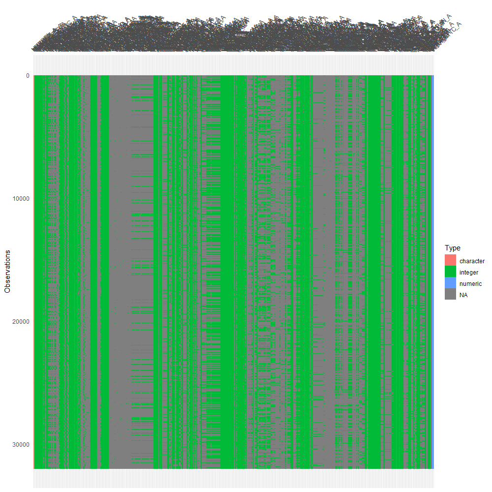

<style>
body, p {
  color: black; 
  font-family: Calibri;
  font-size: large;
}
</style>

# Introduction

Health insurance is a critical safeguard in mitigating the financial risk presented by poor health or sudden injuries received. However, in America, insurers view this as a way to profit and cover people. Thereby, the cost of health insurance widely changes depending on the company. The goal of this project is to **predict this cost**—annualized by premiums—through *machine learning*.

<center>


</center>

The dataset I will be examining is the [2019 National Health Interview Survey](https://www.cdc.gov/nchs/nhis/2019nhis.htm) or NHIS from the CDC website. I will specifically focus on the Sample Adult Interview section of the 2019 NHIS. This is before the events of COVID-19, which adversely affected health insurance.

The NHIS goes very in depth in ascertaining all circumstances involved with human health. Aside from one's own physiological well-being, it also questions info about their demographics such as family, income, diet. Mainly the NHIS dataset can be divided into five categories being **health conditions**, **chronic or severe diseases**, **mental health**, **health insurance**, and **social conditions**.

## Disclaimers and Model Assumptions

Under The [Health Insurance Portability and Accountability Act of 1996](https://www.cdc.gov/phlp/publications/topic/hipaa.html) (HIPAA), sensitive patient health information cannot be disclosed to a third party **without the patient's consent or knowledge**. This applies to the NHIS survey, as a majority of questions asked pertain to such information. As such, this sensitive data is *encoded* to protect the survey participants. As we will see in the data, most variables are factors, with very few being numeric (e.g. non-sensitive information like age, weight, height, etc.).

Despite this limitation, the information is still valuable. By the [Affordable Care Act](https://www.hhs.gov/healthcare/about-the-aca/pre-existing-conditions/index.html), insurers cannot deny to provide coverage for pre-existing conditions, nor can they raise prices to do so upon such knowledge. 

However, what they can do is aggregate that information from all signed contractors and apply that to that pricing. Thereby, a price change is indicative of the whole and not the individual.

We will assume that all respondent's costs are indicative of this.

## Notation

Due to the volume of data present, all variables are abbreviated to shorten variable names. For example, a question that asked a participant if they ever had hypertension would be coded as **HYPEV_A**. \

  * "HYP" (Hypertension) is the topic of the question. \
  
  * "EV" (Ever) is the phrase of the information being asked. \
  
  * "_A" (Answer) is the participants response or recorded data.
 
By understanding the stems of these variable names, we can infer what each variable means and is handy when the discussing the data. I of course will generally use the full name in context, and use the variable name when discussing data.
 
As a side note, you may encounter variables ending with the suffix _**M**_. This indicates that the variable is a mutated type, which I will discuss in more detail below.

# Data Refinement
Now that I've got all that out of the way, it's time we take a look at the data!
```{r setup, message=FALSE, warning=FALSE, class.source = 'fold-hide'}
# Loading in our packages
library(knitr)
library(tidyverse)
library(tidymodels)
library(corrplot)
library(ggplot2)
library(rpart.plot)
library(ranger)
library(vip)
library(doParallel)
set.seed(100)
tidymodels_prefer()
registerDoParallel(cores = parallel::detectCores())

knitr::opts_chunk$set(fig.width=7, fig.height=5)
options(digits = 4)

# data load-in
nhis_data <- read.csv("Unprocessed/adult19.csv")
head(nhis_data)
```

```{r nhis_data dimensions}
# data dimensions
nhis_data %>% dim()
```

That's a lot of data! As you will notice, all variables are numeric, but these are actually encoded. With the exception variables that relate to a range of values (like BMI), participants answers are encoded to numeric values starting from 1 to at most 99 (depending on the amount of answers).

## Missing Data

As you will notice when scrolling through the dataset, there seems to be quite a lot of missing data. But how much is actually missing? 

<center>



</center>

Now that is a lot of missing data! Now this does look worrisome, but there is a reason for this. By the nature of the NHIS survey, there are bound to be follow-up questions corresponding to particular answers. Through these questions (aggregated and represented into predictors), the data then becomes stratified.

As for how I will tackle this, I've elected to remove columns that are missing a majority of responses and missing observations in important predictors. Some predictors pertain to only a few people answering and are of no importance. I can also afford to drop missing observations as the amount of observations is massive.

## Variable Selection

When it came to selecting my predictors, I knew it was going to be a hassle sifting through all 534 columns in the dataset. I relatively understood the basics of what determines the cost of a health insurance premium (e.g. smoking, general health, etc.), but I had to first find them.

Luckily, the NHIS conveniently provided two PDFs, which [summarized](https://ftp.cdc.gov/pub/Health_Statistics/NCHS/Dataset_Documentation/NHIS/2019/adult-summary.pdf) each predictor and included a [detailed codebook](https://ftp.cdc.gov/pub/Health_Statistics/NCHS/Dataset_Documentation/NHIS/2019/adult-codebook.pdf). This really helped me understand what each predictor was, as the corresponding question(s) were noted. After some diligent note-taking, I arrived at the following selected predictors:

```{r removal of predictors}
# Unmodified Predictors 
predictors <- c("HICOSTR1_A","URBRRL","REGION","AGEP_A","SEX_A","PCNTFAM_A","PCNTKIDS_A","PHSTAT_A","HEIGHTTC_A","WEIGHTLBTC_A","DISAB3_A","PHQCAT_A","GADCAT_A","MARITAL_A","FAMINCTC_A","AFVET_A","FDSCAT3_A","INCWRKO_A","PRPLCOV1_A","PLN1PAY2_A")

# Minor types of Cancer
minortype <- c("BLOODCAN_A","BONECAN_A","BREASCAN_A","CERVICAN_A","LARYNCAN_A","LYMPHCAN_A","MELANCAN_A","PROSTCAN_A","SKNMCAN_A","SKNNMCAN_A","SKNDKCAN_A","THROACAN_A","THYROCAN_A","UTERUCAN_A","HDNCKCAN_A","COLRCCAN_A","OTHERCANP_A")

# Major types of Cancer
majortype <- c("BLADDCAN_A","BRAINCAN_A","COLONCAN_A","ESOPHCAN_A","GALLBCAN_A","LEUKECAN_A","LIVERCAN_A","LUNGCAN_A","MOUTHCAN_A","OVARYCAN_A","PANCRCAN_A","RECTUCAN_A","STOMACAN_A")

# Predictors used in various mutations
mutate_pred <- c("HYPEV_A","HYPDIF_A","HYP12M_A","CHLEV_A","CHL12M_A","CHDEV_A","ANGEV_A","MIEV_A","STREV_A","ASEV_A","ASTILL_A","CANEV_A","DIBEV_A","DIBTYPE_A","SMKCIGST_A","SMKECIGST_A","POLHLD1_A")

# Trimming the dataset down
nhis_trimmed <- nhis_data %>% select(all_of(predictors), all_of(minortype), all_of(majortype), all_of(mutate_pred))
```

Our dataset went from *534* variables to only *67*, but that is not the **true amount** I am using. You notice that my predictors are grouped up into named sections. Essentially the `predictors` vector is all predictors not used in a variable mutation process, and the rest are. I will briefly explain the unmodified predictors here and leave the rest in the upcoming section. A more detailed breakdown can be found in the codebook.

  * **`HICOSTR1_A`**: This is our response predictor. It measures the annual payment of health insurance premiums. \
  * **`URBRRL`**: Describes the type of classification where the survey participant lives in. \
  * **`REGION`**: Describes a general region of the US where the survey participant's household is. \
  * **`AGEP_A`**: The numeric age (in years) of the survey participant. \
  * **`SEX_A`**: The sex of the survey participant \
  * **`PCNTFAM_A`**: The number of people (including the participant) in their family. \
  * **`PCNTKIDS_A`**: The number of children in their family. \
  * **`PHSTAT_A`**: An indicator representative of the participant's general health at the time of taking the survey. \
  * **`HEIGHTTC_A`**: Measures the height (in inches) of the participant. \
  * **`WEIGHTLBTC_A`**: Measures the weight (in pounds without shoes) of the participant. \
  * **`DISAB3_A`**: A classification of whether the participant is disabled or not. Determined by the [Washington Group Short Set Composite Disability Indicator](https://www.washingtongroup-disability.com/question-sets/wg-short-set-on-functioning-wg-ss/). \
  * **`PHQCAT_A`**: A gauge of the severity of depressive symptoms under the PHQ scale of the participant. \
  * **`GADCAT_A`**: A gauge of the severity of anxiety symptoms under the GAD scale of the participant. \
  * **`MARITAL_A`**: Contains the relationship status of the participant. \
  * **`FAMINCTC_A`**: Measures the aggregated family income of the respondent. \
  * **`AFVET_A`**: A binary response indicating if the participant has served in the military. \
  * **`FDSCAT3_A`**: An indicator representing the respondent's food security in their household. \
  * **`INCWRKO_A`**: A binary response indicating if the individual earned income from wages that year. \
  * **`PRPLCOV1_A`**: A binary response indicating if the respondent's health insurance plan covers another person. \
  * **`PLN1PAY2_A`**: A binary response indicating if the respondent's employer or union helps pay their insurance. 

Now that we have that out of the way, its time to begin mutating our variables!

## Variable Mutations {.tabset .tabset-fade .tabset-pills}

### Health Insurance
Our response variable `HICOSTR1_A` contains the annual aggregate price of a person's private health insurance premium. Normally, we should consider their deductibles, as they are part of the payment scheme; but no numeric information was included, so we will have to do without. This response is top-coded at $40,000, but values such as 99997 and 99999 are included representing unknown quantities. Thereby we will filter them out.

```{r HICOSTR1_A Filter}
# HICOSTR1_A Filter: 99997-99999, NA
nhis_trimmed <- nhis_trimmed %>% filter(HICOSTR1_A <= 40000)
```

Additionally, we are interested in whether the insurance plan covers one or multiple people. In the dataset, only those who were policyholders were able to answer that question in **`PRPLCOV1_A`**, so we have to filter `POLHLD1_A` to get that information.

```{r Who is a policy holder (POLHLD1_A Filter)}
nhis_trimmed <- nhis_trimmed %>% filter(POLHLD1_A !=2) %>% 
  select(-POLHLD1_A)
```


### Physical Health
Determining one's health condition is a finicky subject! We have to consider when a problematic health condition is relevant in terms of time. However, we are once again restricted from that information, so I will re-frame it in periods of _when they had it_ and _if they currently have it_.

Some notation you might see is the "CUR" stem. This refers to whether they had the health problem when taking the survey. This will become clear in the following mutations:

**Mutated Variables**

 * Hypertension (aka High Blood Pressure)
   * **HYPCUR_M** from `HYPEV_A`, `HYPDIF_A`, and `HYP12M_A`.
     * 1: Has not experienced Hypertension
     * 2: Has a history of Hypertension
     * 3: Has experienced Hypertension within 12 months
 
```{r Hypertension-mutation}
# Hypertention Status
nhis_trimmed <- nhis_trimmed %>% 
  mutate(HYPCUR_M = case_when(HYPEV_A == 2 ~ 1,
                              HYPDIF_A == 2 ~ 2,
                              HYP12M_A == 2 ~ 2,
                              HYP12M_A == 1 ~ 3)) %>% 
  select(-HYPEV_A, -HYPDIF_A, -HYP12M_A) %>% 
  filter(!is.na(HYPCUR_M))
```

 * High Cholesterol
   * **CHLCUR_M** from `CHLEV_A` and `CHL12M_A`
     * 1: Has not experienced High Cholesterol
     * 2: Has a history of High Cholesterol
     * 3: Has experienced High Cholesterol within 12 months

```{r Cholesterol-mutation}
# Cholesterol Status
nhis_trimmed <- nhis_trimmed %>% 
  mutate(CHLCUR_M = case_when(CHLEV_A == 2 ~ 1,
                              CHL12M_A == 2 ~ 2,
                              CHL12M_A == 1 ~ 3)) %>% 
  select(-CHLEV_A, -CHL12M_A) %>% 
  filter(!is.na(CHLCUR_M))
```
   
 * Cardiovascular Conditions (Coronary Heart Disease, Angina, Heart Attack, Stroke)
   * **CDVPCUR_M** from `CHDEV_A`, `ANGEV_A`, `MIEV_A`, and `STREV_A`
     * 1: Has not experienced any cardiovascular conditions
     * 2: Has history of one type of a cardiovascular condition
     * 3: Has history of multiple types of cardiovascular conditions
   
```{r Cardio-mutation}
# Cardiovascular Conditions
nhis_trimmed <- nhis_trimmed %>% 
  mutate(COMBINED = CHDEV_A + ANGEV_A + MIEV_A + STREV_A) %>%
  mutate(CDVPCUR_M = case_when(COMBINED == 8 ~ 1,
                               COMBINED == 7 ~ 2,
                               COMBINED <= 6 ~ 3)) %>%
  select(-COMBINED, -CHDEV_A, -ANGEV_A, -MIEV_A, -STREV_A) %>%
  filter(!is.na(CDVPCUR_M))
```

 * Asthma
   * **ASCUR_M** from `ASEV_A` and `ASTILL_A`
     * 1: Has not had asthma
     * 2: Has an instance of asthma
     * 3: Currently has asthma

```{r Asthma-mutation}
# Asthma Status
nhis_trimmed <- nhis_trimmed %>% 
  mutate(ASCUR_M = case_when(ASEV_A == 2 ~ 1,
                              ASTILL_A == 2 ~ 2,
                              ASTILL_A == 1 ~ 3)) %>% 
  select(-ASEV_A, -ASTILL_A) %>% 
  filter(!is.na(ASCUR_M))
```

 * Diabetes
   * **DIBCUR_M** from `DIBEV_A`, `DIBTYPE_A`
     * 1: Don't have diabetes
     * 2: Have Type 1 diabetes
     * 3: Have Type 2 diabetes
     
```{r Diabetes-mutation}
# Diabetes Status
nhis_trimmed <- nhis_trimmed %>% 
  mutate(DIBCUR_M = case_when(DIBEV_A == 2 ~ 1,
                              DIBTYPE_A == 1 ~ 2,
                              DIBTYPE_A == 2 ~ 3)) %>% 
  select(-DIBTYPE_A, -DIBEV_A) %>% filter(!is.na(DIBCUR_M))
```

### Cancer
This section asks participants if they have cancer and if so, what types of cancer that had. Every significant cancer is asked here and specifies when they knew about it.

For us, we are concerned about if the participant had cancer and not the type they specify. However, I made a distinction for cancers with a high rate of death compared to the rest. For example, lung cancer has a survival rate of 18.6% compared to breast cancer which has a rate of 89.6%. 

**CANSTAT_M** 

  * 1: No Cancer \
  
  * 2: Minor Cancer Type (>60%) \
  
  * 3: Severe Cancer Type (<60%)

Types:
```{r Cancer-mutation}
#Minor Type
nhis_minortype <- nhis_trimmed %>% select(all_of(minortype))

nhis_minortype <- nhis_minortype %>% transmute(test = ifelse(nhis_minortype==1, 1,0))

nhis_minortype <- nhis_minortype %>% transmute(MINORTYPE = rowSums(nhis_minortype,na.rm= TRUE))

# Major Type
nhis_majortype <- nhis_trimmed %>% select(all_of(majortype))

nhis_majortype <- nhis_majortype %>% transmute(test = ifelse(nhis_majortype==1, 1,0))

nhis_majortype <- nhis_majortype %>% transmute(MAJORTYPE = rowSums(nhis_majortype,na.rm= TRUE))

# CANCUR_M
nhis_trimmed <- nhis_trimmed %>% 
  mutate(CANCUR_M = case_when(CANEV_A == 2 ~ 1,
                              nhis_majortype$MAJORTYPE >0 ~ 3,
                              nhis_minortype$MINORTYPE >0 ~ 2)) %>%
  select(-all_of(minortype), -all_of(majortype), -CANEV_A) %>%
  filter(!is.na(CANCUR_M))
```

It is worth mentioning that this assumption is limited. What insurers actually use as a metric is how long the applicant has been without a treatment or resurgence in the cancer development. It is measured by years and the longer the period, the more likely there would not be any additional surcharge.

For example, if someone had lung cancer (pretty fatal cancer) ten years back and is still alive today, then they would be considered to be just as normal as someone who did not. After all, if they still had the cancer and it progressed, then they probably be dead. Usually this cutoff is around 5 years.

But by HIPPA, all we have is whether the participant had this specific cancer and when they first we told they had it, which is necessarily not helpful at all. In our predictor, we are forced to generalize this assumption to whether they currently have it or not. It is not ideal, but there is not much to be done about it.

### Smoking
Smoking is one of the key factors in driving up the price of health insurance. Unlike most health conditions, insurers are allowed to surcharge a client who smokes by up to [50%](https://www.theexprogram.com/resources/blog/what-is-a-tobacco-surcharge-and-how-does-my-company-offer-one/). Of course, the surcharge only applies if certain conditions are met, such as frequency of tobacco smoked, last time cigarette smoked, etc. Most insurance treats smoking and vaping the same and thus we will do the same.

We have to be careful in our classification. Even though some participants indicate they don't smoke (variable `SMKCIGST_A`), they might vape instead (variable `SMKECIGST_A`); which effectively is smoking. Interestingly, I found most of these exceptions are those in the age range 20-40 with some few in the 60s.

**SMOKER_M** 

  * 1: Currently smokes \
  
  * 2: Does not currently smoke \

```{r smoke-mutation}
# Do you smoke cigarettes?
nhis_trimmed <- nhis_trimmed %>% 
  mutate(CIG_M = case_when(SMKCIGST_A == 1 | SMKCIGST_A == 2 ~ 1,
                           SMKCIGST_A == 3 | SMKCIGST_A == 4 ~ 2)) %>% 
  select(-SMKCIGST_A) %>% filter(!is.na(CIG_M))

# Do you vape?
nhis_trimmed <- nhis_trimmed %>% 
  mutate(ECIG_M = case_when(SMKECIGST_A  == 1 ~ 1,
                           SMKECIGST_A == 2 | SMKECIGST_A == 3 ~ 2)) %>% select(-SMKECIGST_A) %>% filter(!is.na(ECIG_M))

# Smoker status
nhis_trimmed <- nhis_trimmed %>% 
  mutate(SMOKER_M = case_when(CIG_M == 1 | ECIG_M == 1 ~ 1,
                           CIG_M == 2 & ECIG_M == 2 ~ 2)) %>% 
  select(-CIG_M, -ECIG_M)
```


### Misc. Filters
A lot of predictors do not have information on certain respondents. This may be because they refused, did not know the answer, or could not due to a NDA or workplace agreement. Instead of showing up as NA, they instead are encoded and assigned numbers. This section removes those values, as they do not fit in our model and are very few. Some numeric predictors also have caps on them, many of which fall far from their actual value.

```{r Misc. filters, class.source = 'fold-hide'}
# AGEP_A Filter: Remove unknown ages, 97 & 99 
nhis_trimmed <- nhis_trimmed %>% filter(AGEP_A <=85)

# PHSTAT_A Filter: Remove unknown health status, 7
nhis_trimmed <- nhis_trimmed %>% filter(PHSTAT_A <=5)

# HEIGHTTC_A Filter: Remove unknown heights to correct cap of 76, 96-99
nhis_trimmed <- nhis_trimmed %>% filter(HEIGHTTC_A <=76)

# WEIGHTLBTC_A Filter: Remove unknown weights to correct cap of 299, 996-999 
nhis_trimmed <- nhis_trimmed %>% filter(WEIGHTLBTC_A <=299)

# PHQCAT_A Filter: Remove unknown depression status, 8
nhis_trimmed <- nhis_trimmed %>% filter(PHQCAT_A !=8)

# GADCAT_A Filter: Remove unknown anxiety status, 8
nhis_trimmed <- nhis_trimmed %>% filter(GADCAT_A !=8)

# AFVET_A Filter: Remove unknown military status, 7-9
nhis_trimmed <- nhis_trimmed %>% filter(AFVET_A <=2)

# PCNTFAM_A & PCNTKIDS_A Filter: Remove unknown family and children counts, 8
nhis_trimmed <- nhis_trimmed %>% filter(PCNTFAM_A <= 6, PCNTKIDS_A <=3)

# INCWRK0_A Filter: Remove unknown working status, 7-9
nhis_trimmed <- nhis_trimmed %>% filter(INCWRKO_A <= 2)

# MARITAL_A Filter: Remove unknown marital status, 7-9
nhis_trimmed <- nhis_trimmed %>% filter(MARITAL_A <= 3)

# FDSCAT3_A Filter: Remove unknown food security status, 8
nhis_trimmed <- nhis_trimmed %>% filter(FDSCAT3_A !=8)

# PRPLCOV1_A Filter: Remove unknown plan coverage, 7-9
nhis_trimmed <- nhis_trimmed %>% filter(PRPLCOV1_A <=2)
```

# Finalization

Wow, that took a while! The sheer capacity of the dataset and its comprehensiveness made the process very slow. In fact, the majority of the time spent in the project came from this section. At the end of it, our dataset is completely transformed from its initial state. But just how much did it change?

```{r nhis_trimmed dimensions}
# nhis_trimmed dimensions
nhis_trimmed %>% dim()
```

In total, our observations dropped from *31997* to *9483*, and our predictor space dwindled from *534* to *27*. That is quite the reduction our data went through! Now that we have selected and cleaned up all the data, we will save it to an excel csv so we can load this in whenever we want.

```{r final dataset}
nhis_final <- write_excel_csv(nhis_trimmed, file ="Processed/nhis_final.csv")

# cleaning-up the workspace
remove(nhis_majortype, nhis_minortype)
```

Before we move onto EDA, we have to do one last thing to our data and that is changing all of nominal predictors into factors. Doing this here will save us some time in our recipe.

```{r set as factors}
# all nominal predictors in nhis_final
factors <- c("URBRRL","REGION","SEX_A","PHSTAT_A","DISAB3_A","PHQCAT_A","GADCAT_A","MARITAL_A","AFVET_A","FDSCAT3_A","INCWRKO_A","HYPCUR_M","CHLCUR_M","CDVPCUR_M","ASCUR_M","DIBCUR_M","CANCUR_M","SMOKER_M","PRPLCOV1_A","PLN1PAY2_A")

# converting the predictors
nhis_final[,factors] <- lapply(nhis_final[,factors], factor)

# check results
sapply(nhis_final, class)
```

Looks good to me! Now that the data is ready, we can move onto our EDA!

# Exploratory Data Analysis (EDA)
Before we start the machine learning process, it is important to do EDA. The reason why we want to do this, is to identify key relationships in our data. We may want to look at the correlations between variables, check the values of our predictors, find interactions, etc. Basically, the information we observe here will help us in later steps (particularly in making the recipe).

## Correlation Matrix

The first thing I wanted to check is the predictor's correlation with one another. Since our model are inherently regression based, correlation between predictors will in turn affect our model. We need to know which relationships exist to account for in our recipe.

```{r corrplot, fig.dim=c(10,10)}
# Correlation Matrix Plot
corrmatrix <- corrplot(cor(nhis_trimmed), type = 'lower', diag = FALSE, tl.cex=0.9)
```

**Positive Correlation:** PNCTKIDS_A - PCNTFAM_A, WEIGHTLBTC_A - HEIGHTTC_A, GADCAT_A - PHQCAT_A, AGEP_A - INCWRKO_A

**Negative Correlation:** SEX_A - HEIGHTTC_A, MARITAL_A - PCNTFAM_A

Most of the strong correlations make sense. It is understandable that height and weight are correlated, as the taller one person is, they will have more weight. These correlations mostly follow this pattern. For the most part, there is no surprising connections, aside from the weak correlations between mutated variables.

## BarChart

Next, I was interested in the distribution of health insurance coverage in `PRPLCOV1_A`. I figured that this would be a critical predictor as having multiple people covered in a plan linearly increases the price. For reference, *1* represents **multiple people covered** and *2* represents **single coverage**.

```{r barchart insurance coverage plan}
ggplot(nhis_final, aes(fill=PRPLCOV1_A, x=PRPLCOV1_A)) + geom_bar()
```

We see that there is a good proportion of both classes, meaning that no necessary changes are required. This barchart also implies that we should see a majority of participants have a low health insurance cost and thereby a low mean insurance cost.

## Boxplots

I then was curious in how some correlations between predictors was distributed among the individual classes. The first set I was interested in was between `AGEP_A` and `CANCUR_M`. I wanted to confirm if people who were older were more likely to have a type of cancer.

```{r cancer boxplot, fig.dim=c(10,10)}
# what age groups have cancer?
ggplot(nhis_final, aes(x=CANCUR_M, y=AGEP_A, fill=CANCUR_M)) + geom_boxplot()
```

We can confirm that the age is categorized evenly with types of cancer. As we look at each cancer class, the average mean between them are distinct. We see that for those with no cancer (1), that the average age is 50 with first quartile at 37 and third quartile at 63. For the minor and major cancers (2 & 3), their means lie at 68 and 72 respectively. There is some overlap between the no cancer and minor cancer class, but it still shows a distinct divide between them.

I also wanted to check the correlation between FAMINCTC_A and PCNTFAM_A. Since FAMINCTC_A is the aggregate of annual family income, I wanted to compare that to the number of adults in PCNTFAM_A. But if you noticed, PCNTFAM_A contains children in that number, so we have to subtract PCNTKIDS_A from PCNTFAM_A.

```{r income boxplot, fig.dim=c(10,10)}
# Family income with respect to number of adults
ggplot(nhis_final, aes(group=PCNTFAM_A - PCNTKIDS_A, x=PCNTFAM_A-PCNTKIDS_A, y=FAMINCTC_A)) + geom_boxplot(color="red", fill="orange", alpha=0.2)
```
As expected, the income of a family does increase with more adults in the family. The first class definitely shows the respondent's individual income as they are included in PCNTFAM_A and are the only adult. With the other classes, it is harder to say if all the adults are working in that family. This is why we observe a larger range in the boxes of the second and third class.

## Histogram

The final thing I wanted to check is the distribution of our response variable HICOSTR1_A. I wanted to get a feel for what premiums our model should be predicting and if anything was concerning. I felt it was best to represent this by a histogram.

```{r cost histogram 1,fig.dim=c(10,10)}
ggplot(nhis_final, aes(x=HICOSTR1_A)) + geom_histogram(binwidth = 1500, color="black", fill="orange")
```

From this histogram, we see an alarming issue. We observe a normal-like distribution hovering around the 2500 mark, but also notice a good portion of data lying far beyond that at around the >20000 range. We have to remember what our response variable is: It is the *annual aggregate cost* of health insurance premiums. This implies that these observations are respondents which paid over $40,000 per year in premia.

Now that is understandable if their plan either covers more than 10 people, or has a high cost basis per monthly premium. The issue with this is that our model at most can account up to 6 people (PCNTFAM_A) and the monthly premium is unknown to us. Thereby, these are significant outliers, which will influence/confuse our model and needs to be limited.

```{r hicostr1_a stats}
# before removal
summary(nhis_final$HICOSTR1_A)
nhis_final <- nhis_final %>% filter(HICOSTR1_A <=20000)

# after removal
summary(nhis_final$HICOSTR1_A)
```
From these statistics, we see mean premium drop by $325 which shows the outliers' influence. Now that they are removed, we shall look at the histogram again.

```{r cost histogram 2,fig.dim=c(10,10)}
ggplot(nhis_final, aes(x=HICOSTR1_A)) + geom_histogram(binwidth = 1500, color="black", fill="orange")
```

From this new histogram, we see our that notion made in the bar chart section was true. The majority of single coverage plans are represented towards the left and the multi coverage plans are shown trickling down the right. We can expect it is likely that as you increase HICOSTR1_A, we can expect a higher proportion of multi coverage plans than single coverage.

And this ends the EDA section! We found out some interesting interactions in our model and we removed a significant influence in our data. Without further ado, we can now begin the modeling process!

# Model Set-up

Before diving directly into the model fitting process. We have to take a few intermediate steps which will benefit us greatly.

## Data Split

The first step is to split our dataset into a training and testing set. Our training set will be used to fit and tune our selected models. The testing set will then gauge those models and determine how well they did in predicting the response variable. The most important factor in this process is choosing a good proportion to split our data. I elected for 75/25 split as the number of observations is vastly large.  

I also choose to stratify the split on our response variable `HICOSTR1_A`, as we don't want a discrepancy of low cost premiums in the training set and a high cost premiums in the testing set.

```{r data split}
nhis_split <- initial_split(nhis_final, prop = 0.75, strata = HICOSTR1_A)
nhis_train <- training(nhis_split)
nhis_test <- testing(nhis_split)
```

## Model Recipe

The second step is creating our recipe for our models to fit to. There isn't anything too fancy in our recipe; I am just going to dummy code our nominal predictors, add interaction terms for all strongly correlated predictors, and normalize them at the end.

```{r nhis recipe}
nhis_recipe <- recipe(HICOSTR1_A ~., data=nhis_train) %>%
  step_dummy(all_factor_predictors()) %>% 
  step_interact(terms = ~ PCNTFAM_A:FAMINCTC_A +
                  starts_with("PHQCAT"):starts_with("GADCAT") +
                  starts_with("PCNTFAM"):starts_with("MARITAL") +
                  starts_with("INCWRKO"):starts_with("AGEP") +
                  starts_with("PRPLCOV"):starts_with("MARITAL") + 
                  starts_with("PRPLCOV"):starts_with("PCNTFAM")) %>%
  step_normalize(all_predictors())
```

## Cross Validation

The last step we need to do, is performing cross validation. This is a very necessary process as we want to avoid our model overfitting to the training set and consequentially perform worse in the testing set. By subdividing the training set into even partitions, we fit our models to them, and compare the results to each other. This in turn will reduce overfitting our models and highlight the parameters that perform well in the partitions.

Just as we stratified in the data splitting step, we will also stratify in the cross-validation process by HICOSTR1_A. For my project, I chose to do a 5-fold cross validation as each fold will roughly have the same amount of observations as the testing set.

```{r cross validation}
# Cross-validation with k = 5
nhis_folds <- vfold_cv(nhis_train, v=5, strata = HICOSTR1_A)
```

With the final step finished, we can now begin the model fitting process!

# Regression Models

For my models, I plan to use **linear regression**, **k-nearest neighbors**, **elastic net**, **decision trees**, and **random forest**. I wanted a mix of simple and complex regression models to compare to each other at the end. For example, I want to see if a simple linear regression model will fare better than an elastic net model, and the same goes for a decision tree versus a random forest. The metric I will be using to gauge this, is *rsq*. I chose rsq over RMSE, as it is a much easier metric to understand and compare. 

First we set up the model and then the workflow:

```{r regression models, class.source = 'fold-hide'}
# Basic Linear Regression
lm_model_cv <- linear_reg() %>% set_engine("lm")
lm_wkflow_cv <- workflow() %>% add_model(lm_model_cv) %>%
  add_recipe(nhis_recipe)

# K-nearest Neighbors
knn_model_cv <- nearest_neighbor(neighbors = tune()) %>%
  set_engine("kknn") %>%
  set_mode("regression")

knn_wkflow_cv <- workflow() %>% add_model(knn_model_cv) %>%
  add_recipe(nhis_recipe)

# Elastic Net
elastic_model_cv <- linear_reg(mixture = tune(), penalty = tune()) %>%
  set_mode("regression") %>% 
  set_engine("glmnet")

elastic_wkflow_cv <- workflow() %>% add_model(elastic_model_cv) %>% 
  add_recipe(nhis_recipe)

# Basic Decision Tree
tree_spec <- decision_tree(cost_complexity = tune()) %>%
  set_engine("rpart") %>% 
  set_mode("regression")

tree_wf <- workflow() %>% 
  add_model(tree_spec) %>% 
  add_recipe(nhis_recipe)

# Random Forest
rforest_model <- rand_forest(mtry = tune(), 
                           trees = tune(), 
                           min_n = tune()) %>%
  set_engine("ranger",importance = "impurity") %>% 
  set_mode("regression")

rforest_wkflow <- workflow() %>% 
  add_model(rforest_model) %>% 
  add_recipe(nhis_recipe)
```

Then we make tuning grids for any models with hyperparameters:
```{r grid_regular, class.source = 'fold-hide'}
# k-nearest neighbors
knn_grid <- grid_regular(neighbors(range = c(1, 10)), levels = 10)

# elastic net
elastic_grid <- grid_regular(penalty(range =c(0.01,3), 
                                     trans = identity_trans()),
                             mixture(range = c(0, 1)),
                             levels = 10)

# pruned decision tree
decision_grid <- grid_regular(cost_complexity(range = c(-3, -1)), levels = 10)

# random forest
rforest_grid <- grid_regular(mtry(range = c(1, 26)), 
                        trees(range = c(200, 1100)),
                        min_n(range = c(4, 50)),
                        levels = 10)
```

Now they are ready to be fitted!

## Model Fitting

For my convenience and yours, all of my regression models were fitted ahead of time and saved to a rda file. If you are interested in the exact model fitted, refer to the corresponding named chunk. Otherwise, we will skip to the model results!


*Linear Regression Fit*

```{r linear regression fit, eval=FALSE, warning=FALSE, class.source = 'fold-hide'}
lm_tune_res <- tune_grid(lm_wkflow_cv, resamples = nhis_folds)
save(lm_tune_res, file = "RDA-Files/nhis-linear-results.rda")
```

*K-Nearest Neighbors Fit*

```{r knn fit, eval=FALSE, class.source = 'fold-hide'}
knn_tune_res <- tune_grid(object = knn_wkflow_cv, 
  resamples = nhis_folds, 
  grid = knn_grid)

save(knn_tune_res, file = "RDA-Files/nhis-knn-results.rda")
```

*Elastic Net Fit*

```{r elastic net fit, eval=FALSE, warning=FALSE, class.source = 'fold-hide'}
elastic_tune_res <- tune_grid(elastic_wkflow_cv,
  resamples = nhis_folds, 
  grid = elastic_grid)

save(elastic_tune_res, file = "RDA-Files/nhis-elastic-results.rda")
```

*Decision Tree Fit*

```{r decision tree, eval=FALSE, class.source = 'fold-hide'}
tree_tune_res <- tune_grid(
  tree_wf, 
  resamples = nhis_folds, 
  grid = decision_grid
)

save(tree_tune_res, file = "RDA-Files/nhis-tree-results.rda")
```

*Random Forest Fit*

```{r random forest, eval=FALSE, class.source = 'fold-hide'}
rforest_tune_res <- tune_grid(rforest_wkflow,
  resamples = nhis_folds, 
  grid = rforest_grid)


# Around 1:30 hours to run
save(rforest_tune_res, file = "RDA-Files/nhis-rforest-results.rda")
```

Now we load-in back in our models!

```{r model load-in}
load(file = "RDA-Files/nhis-linear-results.rda")
load(file = "RDA-Files/nhis-knn-results.rda")
load(file = "RDA-Files/nhis-elastic-results.rda")
load(file = "RDA-Files/nhis-tree-results.rda")
load(file = "RDA-Files/nhis-rforest-results.rda")
```


## Model Results

It is now the moment of truth! Will my models fare well in predicting our response variable? Up first is the simple linear regression model.

```{r lm results}
collect_metrics(lm_tune_res)
```

It appears that it did not do well at all! It had a rsq of 0.1867, which means it could not predict a majority of variance in the response variable. This is a bit foreboding as the linear regression model is a benchmark of how well the rest of your models will do. The next model in the list is the k-nearest neighbors model!

```{r knn results}
best_knn_nhis <- select_by_one_std_err(knn_tune_res, desc(neighbors), metric = "rsq")
best_knn_nhis
```

This one didn't do good either! It had a rsq of 0.7829, which is significantly lower than the linear regression. I can't say I am not surprised by this though. My recipe did include up to 26 variables, so I'm going to attribute this to the curse of dimensionality. Now we will look at the elastic net model!

```{r elastic net results}
best_elastic_nhis <- select_by_one_std_err(elastic_tune_res, desc(penalty),desc(mixture), metric = "rsq")
best_elastic_nhis
```

Similarly, our elastic net model did just the same as our simple linear regression. It did have a slight increase in rsq, moving up to a value of 0.1873, but nonetheless still bad. Now, we will look at the decision tree model!

```{r tree results}
best_tree_nhis <- select_by_one_std_err(tree_tune_res, desc(cost_complexity), metric = "rsq")
best_tree_nhis
```

Alright it got some slight improvement over all the other models. Its rsq is 0.1989 and its so close to 0.20. Do you think the last model, random forest, can reach it?

```{r random forest results}
show_best(rforest_tune_res, metric = "rsq") %>% head(1)

best_rforest_nhis <- select_best(rforest_tune_res, min_n, trees, mtry, metric = "rsq")
```

Random Forest breaches the barrier! We end off with a rsq of 0.2295 which is the highest we found! Even though the rsq is still low, this is our best model.

**Ranking**: Random Forest > Decision Tree > Elastic Net > Simple Linear Regresson > K-Nearest Neighbors

# Fitting Best Regression Model

Now that we have found our best model and tuned it, it's time to fit it back to the training set. Once we have fitted it to the training set, we will look at the most important predictors used in the random forest.

```{r random forest best predictor}
rforest_final_nhis <- finalize_workflow(rforest_wkflow, best_rforest_nhis)

rforest_final_nhis <- fit(rforest_final_nhis, nhis_train)

rforest_final_nhis %>% extract_fit_parsnip() %>% 
  vip()
```

From our variable importance chart, we see that our numeric predictors seem to be the most important. The top predictor used was an interaction term between PRPLCOV1_A (second level) and PCNTFAM_A. This makes sense as I expected there to be a distinct difference between the cost of a plan covering one person and a plan covering multiple people. With this interaction term, it would show how that difference in coverage would play into the model.

I also notice that none of the mutated variables created show up here. That is interesting to me because I thought those would have had significant impact on the response variable. Potentially this may be something to look into if I ever return back to this project.

With the random forest model fitted to the training set, it is now time to fit it to the testing set and see the final results!

```{r rforest final fit}
augment(rforest_final_nhis, new_data = nhis_test) %>% rsq(truth = HICOSTR1_A, estimate =.pred)
```

Our final rsq is **0.2426**, which is a slight increase over the cross-validation rsq. This rsq is still bad as it implies we can explain only a fourth of the variance in the response variable.

# Conclusion
While initially it seemed like a good idea to use this dataset to predict health insurance premiums, my model did not fare well in the end. As for why this may have occurred may be due to the amount of information obscured in the nominal predictors.

In our recipe, we included a total of 6 numeric predictors and 20 nominal predictors. While there is nothing wrong with nominal predictors, there is only so much information it can offer than a numeric predictor which has variance. As a result, the models we fit have to rely on our numeric predictors more than the nominal predictors.

It also happened that the range of my outcome was very wide. While most of the data centered around 2400, there was data that went up to 20000 (after being capped to that amount). This wide range plays into the fact that our observations of 9366 may not have been sufficient to predict accurately. This I believe may be the reason why we cannot explain a good majority of the variance in our data.

Regardless of what I think went wrong, it remains a fact that the model did not perform well. Even though the recipe used all the predictors that are important in health premiums, it missed the mark completely. It just shows that every specific detail in the process is needed and cannot be substituted by factors generalizing it.

Overall, I had a great time doing this project and learned a lot about health insurance as a whole and machine learning. While it was disappointing to see the end result, it won't stop me from improving it in the near future. Thanks for viewing my project and have a nice day!